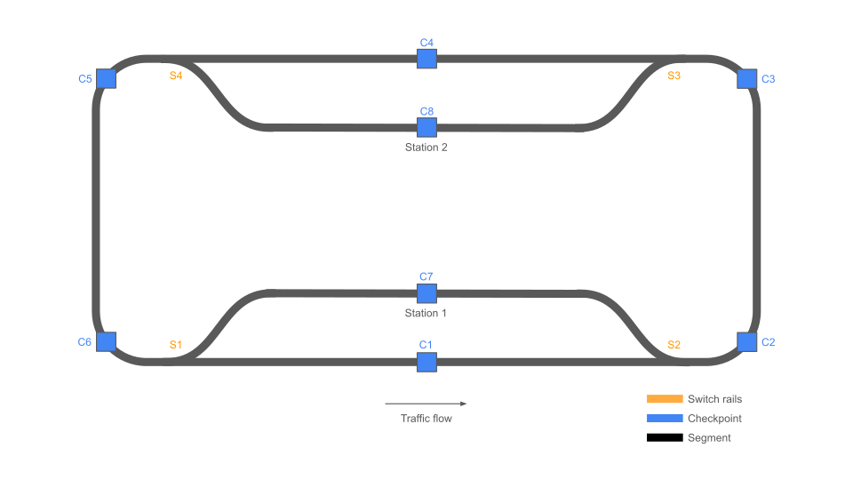

# LOCO-LOCO project

A repository gathering all tools for fully controlling model train through a Web browser interface.

## Pre-requisites

Both `rustup` and `cargo` should be installed on your machine.
Also, install `picotool` following the instructions from
https://github.com/raspberrypi/picotool

### Rustup targets

```
rustup target add aarch64-unknown-linux-gnu
rustup target add thumbv8m.main-none-eabihf
```

### Udev rules

Copy udev rules over to your machine in order to allow for running `picotool`
without the need for `sudo` privileges, and also to make the board show up
as `/dev/ttyACM*` while running. This allows for easier debugging.

```
sudo cp udev_rules/99-rp-pico2w.rules /etc/udev/rules.d/
```

## Loco Controller

### Build

```
cargo build --target aarch64-unknown-linux-gnu
```

### Usage

Run the controller as follows:
```
./loco_controller \
    --http-port 8080 \
    --backend-locos-port 8004 \
    --backend-sensors-port 8005 \
    --backend-actuators-port 8006 \
```

### Prepare the board

We are using a Raspberry Pi Zero 2W to act as the controller board for this
project, but obviously any computer that can act as a WiFi access point would
work.

#### Download Raspberry Pi OS

Go to the official
[website](https://www.raspberrypi.com/software/operating-systems/) to download
the __Rasberry Pi OS (64-bit)__ version which is compatible with the Pi Zero 2W.

#### Flash the image

Download and install the __Raspberry Pi Imager__ tool in order to flash the OS
image to a microSD card.

#### Configure as WiFi access point

Insert the microSD into the Raspberry Pi Zero 2W, plug a USB Ethernet adapter,
and plug the power to boot.

From another computer, SSH into the Pi to configure it as WiFi access point.

_Update system with latest packages_

```
sudo apt update
sudo apt upgrade
sudo reboot
```

_Install a file editor (ViM)_

```
sudo apt install vim
```

_Configure Network Manager_

```
sudo nmcli device wifi hotspot ssid loco-controller password locoloco autoconnect yes
```

_Check Network Manager configuration_

```
sudo vim /etc/NetworkManager/system-connections/Hotspot.nmconnection
sudo vim /etc/NetworkManager/NetworkManager.conf
sudo vim /etc/NetworkManager/system-connections/preconfigured.nmconnection
```

_Restart Network Manager_

```
sudo systemctl restart NetworkManager
```

_Restart the board_

```
sudo reboot
```

At this point the Pi should be exposing its `wlan0` interface as an access
point.

#### Setup `locoloco` service

We must ensure `loco_controller` will be started during the board's startup.

Creating a service is the right way to delegate this task to `systemd`, which
will make sure to restart the program if it terminates for any reason.

_Create `loco_controller`'s directory_

```
mkdir -p /home/locoloco/controller
```

Assuming we have built `loco_controller` binary (see [instructions](#build)),
and assuming it is available from the board at
`/home/locoloco/controller/loco_controller` path, we can create the `locoloco`
service.

_Create `locoloco` service_

```
sudo cat > /lib/systemd/system/locoloco.service<< EOF
[Unit]
Description=LocoLoco service
After=multi-user.target

[Service]
Type=idle
Environment="RUST_LOG=debug"
ExecStart=/home/locoloco/controller/loco_controller

[Install]
WantedBy=multi-user.target
EOF

sudo chmod 644 /lib/systemd/system/locoloco.service
sudo systemctl daemon-reload
sudo systemctl enable locoloco.service
sudo reboot                              
```

_Check `locoloco` service is running_

```
sudo systemctl status locoloco.service
journalctl -f -u locoloco.service -b
```

### HTTP requests

Use `cURL` for sending requests to the HTTP server.

#### Check server is running

```
curl -X GET http://localhost:8080/
```

#### Query status of a loco

```
curl -X GET http://localhost:8080/loco_status/loco1
```

#### Control a loco

```
curl -X POST http://localhost:8080/control_loco \
    -H 'Content-Type: application/json' \
    -d '{"loco_id":"loco1", "direction": "forward", "speed": "fast"}'
```

#### Drive a switch rails

```
curl -X POST http://localhost:8080/drive_switch_rails \
    -H 'Content-Type: application/json' \
    -d '{"actuator_id":"switchrails1", "state": "direct"}'
```

## Pico programs

### Loco Pico

This is the code running on the Pi Pico 2 W embedded in every loco. It registers
itself to the `loco_controller` so that later on it can receive some requests
coming from the `loco_controller`. A request can be the result of an HTTP
request being forwarded all the way to the loco, or simply due to some internal
requirements.

### Sensors Pico

This is the code running on the Pi Pico 2 W attached to all RFID readers. These
readers act as waypoints to locate locos and report these information to the
`loco_controller`. The program connects to the `loco_controller` and reports
periodically the updated locations if any. Then, it's up to the
`loco_controller` to decide what to do with these information. The location is
reported through the HTTP request `loco_status`.

### Build

```
cargo build --target thumbv8m.main-none-eabihf
```

### Flash the board

__loco_pico__
```
picotool load -t elf target/thumbv8m.main-none-eabihf/debug/loco_pico -fx
```

__sensors_pico__
```
picotool load -t elf target/thumbv8m.main-none-eabihf/debug/sensors_pico -fx
```

__actuators_pico__
```
picotool load -t elf target/thumbv8m.main-none-eabihf/debug/actuators_pico -fx
```

### Debug logs

Display logs from the Pi Pico 2 W board by connecting it to USB on your machine
and by running `screen` command:

```
screen /dev/ttyACM0
```

## Railway network

Below is the representation of the railway network, which clearly identifies
the location of switch rails, checkpoints and segments.



Note a segment is the path between two consecutive checkpoints. There are 10
segments on this network.